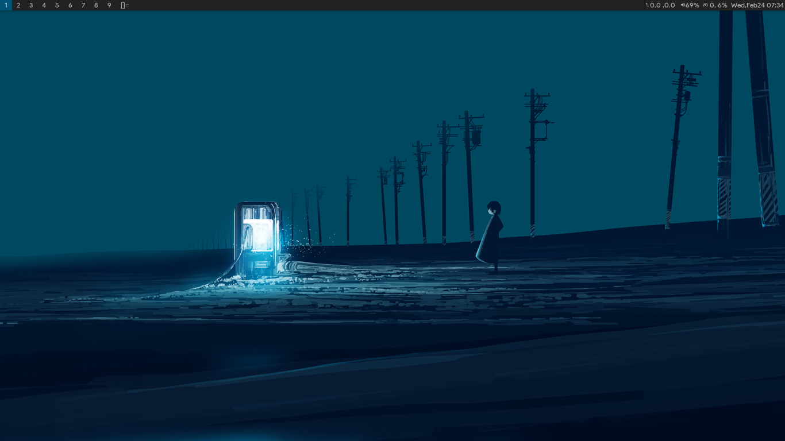

# dwm: Dynamic Window Manager



Welcome to my personal build of dwm. dwm is an incredible lightweight and fast tiling window manager for X developed by the [suckless](https://suckless.org/) community. The window manager is written in C and also requires the enduser to modify the code if changes are desired.

## Patches

- [fullgaps](https://dwm.suckless.org/patches/fullgaps/dwm-fullgaps-20200508-7b77734.diff). Enable gaps between windows.
- [notitle](https://dwm.suckless.org/patches/notitle/dwm-notitle-6.2.diff). Removes window title
- [center](https://dwm.suckless.org/patches/center/dwm-center-6.2.diff). Automatically center clients

## Extra

- [Product Sans](https://gitlab.com/sinanmohd/dots/-/tree/master/font/google-sans)
- [Slstatus](https://gitlab.com/sinanmohd/dots/-/tree/master/slstatus)
- [Material Design Icons](https://aur.archlinux.org/packages/ttf-material-design-icons-git/)

## Usage

```
git clone https://github.com/sinanmohd/dwm
```

```
sudo make clean install
```

If you are using xinitrc. add the following line to your .xinitrc to start dwm using startx

```
exec dwm
```
